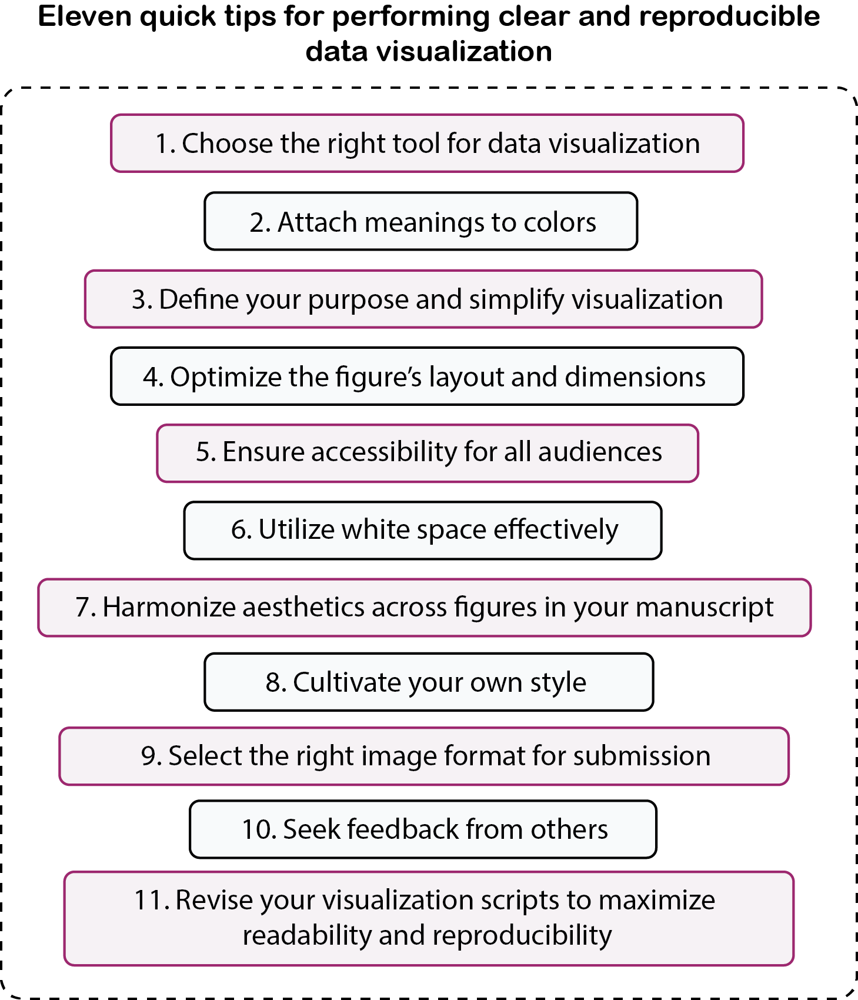
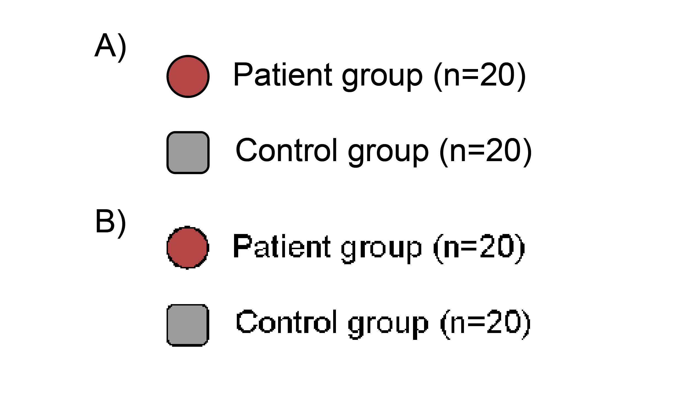

```{r setup, include=FALSE}
knitr::opts_chunk$set(echo = TRUE)
```

$^1$Affiliated Eye Hospital, School of Optometry and Ophthalmology, Wenzhou Medical University, Wenzhou, China.

Address for correspondence: [seung.min\@mail.mcgill.ca](seung.min@mail.mcgill.ca)

\setlength\parindent{24pt}

# Abstract {-}

Data visualization is an important skill in scientific research, enabling researchers to communicate clearly about their complex findings. As experimental data in computational biology and other fields grow in complexity, the need to craft clear data visualization has become increasingly apparent. Recently, open science practices have also gained traction, encouraging researchers to perform visualization routines that are reproducible. To address these concerns, this paper introduces eleven quick tips for creating clear and reproducible data visualizations. These rules touch upon various topics, such as how to choose the most appropriate software to visualize data, organize scripts for reproducibility, and customize aesthetics that are both informative and aesthetically pleasing. By adopting these principles, researchers can streamline their visualization workflows, maximize clarity, and perform reproducible research. All visualization code and examples are freely available on GitHub (https://github.com/smin95/datavizTips).
 
# Introduction {-}

Effective data visualization is essential for clear scientific communications. As datasets in computational biology, genetics and neuroscience have become increasingly sophisticated, the need to craft visualizations that are clear, informative and aesthetically pleasing has become more apparent in scientific research. However, the challenge of data visualization extends beyond aesthetics and clarity. Reproducibility has been proven to be equally important in scientific practices because it enables researchers to reliably recreate graphics from shared datasets, ensuring transparency and validation of results.

This paper distills eleven quick tips for crafting data visualizations that are compelling, reproducible, and accessible to researchers across disciplines and levels of experience. These tips are illustrated using the R package *smplot2* [@min2024visualization], which was designed to streamline the application of these tips using a *ggplot2* workflow (https://smin95.github.io/dataviz). This manuscript is computationally reproducible as it has been written with R Markdown entirely [@xie2018r], with the source code available on GitHub (https://github.com/smin95/datavizTips). While the examples here leverage *smplot2*, the guidelines presented here are broadly applicable and adaptable to various tools and software. The goal is to empower researchers to elevate their data visualization practices, ensuring clarity, elegance, and reproducibility in their work.

```{r, echo=FALSE, fig.align = 'center',fig.cap = "Eleven quick tips for performing clear and reproducible data visualization.", out.width = '65%'}

```


# Tip 1: Choose the right tool for data visualization {-}

Selecting the tool for data visualization is important [@rougier2014ten]. The decision should be based on accessibility, familiarity, and reproducibility. 

First, prioritize tools you are most comfortable with. This is because visualization can consume a lot of time and effort, especially during revision stages for journal submissions. Using familiar software can reduce time spent on troubleshooting and the chance of making mistakes during the visualization process.

Second, consider reproducibility when choosing your visualization tool. For example, programmatic visualization (i.e., by writing codes in R or Python) allows you to document each step of the process, where each line of code serves as a blueprint for preserving and recreating your visualization workflow. In contrast, relying on graphic editing software, like Adobe Illustrator, can compromise reproducibility because each aesthetic modification has to be manually performed with a point-click mouse. 

Finally, consider free and open-source tools for visualization because they have large active communities that continuously improve these open-source tools. Over the last 15 years, numerous open-source tools have emerged to support researchers in data visualization. Libraries such as *ggplot2* [@wickham2009ggplot2] in R and *matplotlib* [@hunter2007matplotlib] in Python have set the foundation for modern data visualization in scientific research. These libaries have been complemented by extension packages, such as *ggstatsplot* [@patil2021visualizations], *patchwork* [@pedersen2019package], *cowplot* [@wilke2019package] and *ggrain* [@allen2019raincloud] for *ggplot2* [@wickham2009ggplot2], as well as *seaborn* [@waskom2021seaborn] for *matplotlib* [@hunter2007matplotlib]. Together, they provide researchers with resources to document and reproduce their visualization workflows seamlessly across platforms and systems, aligning with the growing emphasis on open science. 

Nevertheless, if annotations using vector graphics software are necessary, then try to keep them minimal (e.g., figure labels). Alternatively, explore various third-party packages within your chosen tool to achieve similar enhancements while maintaining reproducibility.

By choosing the right tool, academic researchers can craft data visualizations that are aesthetically pleasing, informative and reproducible. 

# Tip 2:	Attach meanings to colors {-}


```{r, echo = FALSE, warning=F, message=F}
library(tidyverse)
library(smplot2)

set.seed(2022) # generate random data of the control group
nObs <- 20

dose1 <- abs(rnorm(nObs, 2, 1))
dose2 <- abs(rnorm(nObs, 3.5, 1))
dose3 <- abs(rnorm(nObs, 4.5, 1))
Subject <- rep(paste0("N", seq(1:nObs)), 3)
Data <- data.frame(Value = matrix(c(dose1, dose2, dose3), ncol = 1))
Dose <- rep(c("10%", "30%", "50%"), each = nObs)
df1 <- cbind(Subject, Data, Dose)
df1$Group <- "Normal"

dose1 <- abs(rnorm(nObs, 1, 1)) + 0.1
dose2 <- abs(rnorm(nObs, 1.5, 1)) + 0.1
dose3 <- abs(rnorm(nObs, 2.5, 1)) + 0.1
Subject <- rep(paste0("P", seq(1:nObs)), 3)
Data <- data.frame(Value = matrix(c(dose1, dose2, dose3), ncol = 1))
Dose <- rep(c("10%", "30%", "50%"), each = nObs)
df2 <- cbind(Subject, Data, Dose)
df2$Group <- "Patient"

df <- rbind(df1, df2)
```

```{r, echo = FALSE , results='hide'}
# bar graphs
cList_all <- list(
  list(
    sm_palette(3),
    sm_color("purple", "orange", "viridian")
  ),
  list(
    c("#BFBFBF", "#7F7F7F", "#4d4b4b"),
    c("#c4a5a5", "#a04b4f", "#6b3c3c")
  )
)

nExample <- 2
shape_list <- c(21, 22)
group_list <- c("Normal", "Patient")
title_list <- c("No meaning of colors", "Meaningful colors")

lapply(1:nExample, function(iEx) {
  bar_plots <- lapply(1:length(group_list), function(iGroup) {
    currData <- df %>% filter(Group == group_list[[iGroup]])

    currData %>%
      ggplot(aes(x = Dose, y = Value, fill = Dose)) +
      sm_bar(
        bar.params = list(
          alpha = 0.4, color = "transparent",
          width = 0.8
        ),
        point.params = list(
          shape = shape_list[[iGroup]],
          alpha = 1,
          size = 2,
          stroke = 0.4,
          color = "white"
        ),
        forget = TRUE,
        point_jitter_width = 0.2
      ) +
      scale_fill_manual(values = cList_all[[iEx]][[iGroup]]) +
      scale_y_continuous(limits = c(0, 7.5))
  })


  plots_tgd <- sm_put_together(bar_plots,
    title = title_list[[iEx]],
    xlabel = "Drug dose",
    ylabel = "Treatment effect",
    ncol = 2, nrow = 1, hmargin = -2, wmargin = -2,
    wRatio = 1.05, tickRatio = 1.3
  )
  plots_tgd1 <- plots_tgd +
    sm_add_text(label = "Controls (n=20)", x = 0.22, y = 0.81, size = 14) +
    sm_add_text(label = "Patients (n=20)", x = 0.67, y = 0.81, size = 14)


  ggsave(paste0("combined_plot_drug", (iEx - 1), ".pdf"), plots_tgd1,
    height = 3.4, width = 8.8
  )
})
```


```{r, echo=FALSE, fig.align = 'center',fig.cap="First attempt - Colors have no meanings.", out.width = '100%'}
knitr::include_graphics("combined_plot_drug0.pdf")
```

```{r, echo=FALSE, fig.align = 'center',fig.cap="Final attempt - Colors have meanings.", out.width = '100%'}
knitr::include_graphics("combined_plot_drug1.pdf")
```

Colors in data visualization should do more than enhance aesthetics; they should convey meaningful information about the dataset and the study design. Colors can serve three primary purposes:

1. To display grouping (e.g., discrete color schemes).

2. To represent quantitative values (e.g., continuous color schemes).

3. To highlight key features over others [@wilke2019fundamentals].

Consider a clinical study investigating the effects of a drug at three doses across two participant groups: a control group and a patient group. In other words, each participant has received three different doses of the drug. Figures 2 and 3 demonstrate different uses of color to visualize the synthetically generated data. 

In Figure 2, the colors are unrelated to the study design, such as the grouping of subjects and the dose of the drug. Similar colors are also used across groups without a clear distinction, which could confuse readers. For example, the control's group 30\% dose is represented by green, as is the patient group's 50\% dose, creating a false impression of similarity. While the figure appears aesthetically clean, the lack of deliberate color choice makes it harder to understand the study design for readers.

In contrast, Figure 3 utilizes colors that inform about the study design. The patient group is highlighted with a bold, visible palette (e.g., shades of red), while the control group uses muted tones (e.g., shades of grey). Within each group, color saturation increases with the drug dose, intuitively indicating quantitative differences. Additionally, distinct color palettes for each group can ensure clarity, even for readers with colorblindness, by using colorblind-friendly palettes where possible [@hattab2020ten]. Figure 4 also lacks legend, demonstrating that key information can still be missing even if it can be visually overwhelming.

By attaching meaning to colors, visualizations can effectively convey study design, quantitative differences and key features (i.e., patient group rather than control group).


# Tip 3: Define your purpose and simplify visualization {-}

```{r, echo=F, message=F, warning=F, results='hide'}
df3 <- read_csv("https://www.smin95.com/amblyopia_random.csv") %>%
  filter(Condition == "One") %>%
  mutate(logSF = log2(SF))

df3b <- df3 %>%
  group_by(logSF, Group) %>%
  summarise(
    avgBP = mean(absBP),
    stdErr = sm_stdErr(absBP),
    .groups = "drop"
  )

cList <- c("#a04b4f", "#7F7F7F")

library(cowplot)
df3b %>%
  ggplot(aes(
    x = logSF, y = avgBP, group = Group,
    color = Group, fill = Group, shape = Group
  )) +
  draw_label(
    label = "Figure 4", x = 1, y = 0.625,
    size = 45, angle = 45, color = "gray50",
    alpha = 0.5, fontface = "bold"
  ) +
  annotate("rect",
    xmin = -Inf, xmax = Inf, ymin = -Inf, ymax = 0.25,
    fill = sm_color("blue"), alpha = 0.15, color = NA
  ) +
  annotate("rect",
    xmin = -Inf, xmax = Inf, ymin = 0.25, ymax = 0.5,
    fill = sm_color("orange"), alpha = 0.15, color = NA
  ) +
  annotate("rect",
    xmin = -Inf, xmax = Inf, ymin = 0.5, ymax = 0.75,
    fill = sm_color("green"), alpha = 0.15, color = NA
  ) +
  annotate("rect",
    xmin = -Inf, xmax = Inf, ymin = 0.75, ymax = 1,
    fill = sm_color("crimson"), alpha = 0.15, color = NA
  ) +
  annotate("rect",
    xmin = -Inf, xmax = Inf, ymin = 1, ymax = Inf,
    fill = sm_color("purple"), alpha = 0.15, color = NA
  ) +
  geom_line(linewidth = 1.2) +
  geom_linerange(aes(logSF, ymin = avgBP - stdErr, ymax = avgBP + stdErr),
    linewidth = .85, show.legend = FALSE
  ) +
  geom_point(color = "white", size = 3.5) +
  scale_color_manual(
    values = cList,
    labels = c("Patient", "Control")
  ) +
  scale_shape_manual(
    values = c(21, 22),
    labels = c("Patient", "Control")
  ) +
  scale_fill_manual(
    values = cList,
    labels = c("Patient", "Control")
  ) +
  sm_hgrid(legends = F) +
  xlab("Scale") +
  ylab("Value") -> wow

ggsave("wow.pdf", wow,
  height = 3.2, width = 3.2
)
```

```{r, echo=FALSE, fig.align = 'center',fig.cap="Excessive visual clutter can distract the reader from the data.", out.width = '50%'}
knitr::include_graphics("wow.pdf")
```

Reading a scientific paper can challenging and cumbersome, especially for early trainees and non-experts. Often, readers turn to figures as visual summaries of key findings. However, a visually crowded or overly complex figure can be confusing. 

Creating a figure that effectively conveys its message requires you to first outline the figure's purpose before plotting it. Make sure to emphasize the aesthetics that center around the core graphical elements of the figure's purpose. 

Simplicity is also critical. Avoid overloading figures with excessive annotations, decorative elements, or irrelevant details. Instead, include only a moderate amount of annotations to guide the reader's attention to the data. Figure 3 illustrates this point by presenting a minimalistic bar graph with minor text annotations, emphasizing the key findings without visual clutter. On the other hand, Figure 4 has extraneous elements, such as multi-colored background and a large pasted text "Figure 4" behind the line plots, potentially distracting the reader from the data.

By defining the purpose of your figure and simplifying its appearance, you can create visualizations that convey important information clearly without shifting reader's attention away.


```{r, echo = F, fig.show = 'hide', warning=F, message=F}
nObs <- 8
cList <- sm_palette()

df2 <- read_csv("https://www.smin95.com/amblyopia_random.csv") %>%
  filter(Subject %in% paste0("A", 1:nObs)) %>%
  filter(Group == "Amblyopia") %>%
  filter(Condition == "One") %>%
  mutate(logSF = log2(SF))

all_plots <- lapply(1:nObs, function(iObs) {
  currData <- df2 %>% filter(Subject == paste0("A", iObs))

  currData %>%
    ggplot(aes(x = logSF, y = absBP, group = Subject)) +
    geom_line(color = cList[iObs], linewidth = 1.2) +
    geom_point(
      size = 5, shape = 21, color = "white",
      fill = cList[iObs], stroke = 1
    ) +
    sm_hgrid() +
    scale_y_continuous(limits = c(0, 2)) +
    scale_x_continuous(
      limits = c(-1.3, 3.3),
      labels = c(0.5, 1, 2, 4, 8)
    ) +
    annotate("text",
      x = -0.1, y = 1.75, label = paste0("Subject ", iObs),
      size = 5.5
    )
})

plots_tgd <- sm_put_together(all_plots,
  title = "Two rows and six columns",
  xlabel = "Spatial frequency (c/deg)",
  ylabel = "Value",
  ncol = 6, nrow = 2, hmargin = -4, wmargin = -4
)

plots_tgd1 <- plots_tgd +
  sm_add_text(
    label = ("0.5    1      2      4      8"),
    x = 0.485, y = 0.505, size = 17
  ) +
  sm_add_text(
    label = ("0.5    1      2      4      8"),
    x = 0.632, y = 0.505, size = 17
  ) +
  sm_add_text(
    label = ("0.5    1      2      4      8"),
    x = 0.778, y = 0.505, size = 17
  ) +
  sm_add_text(
    label = ("0.5    1      2      4      8"),
    x = 0.925, y = 0.505, size = 17
  )

ggsave("indv_plot0.pdf", plots_tgd1,
  height = 7, width = 19.2
)

plots_tgd2 <- sm_put_together(all_plots,
  title = "Two rows and four columns",
  xlabel = "Spatial frequency (c/deg)",
  ylabel = "Value",
  ncol = 4, nrow = 2, hmargin = -2, wmargin = -2,
  wRatio = 1.15
)

ggsave("indv_plot1.pdf", plots_tgd2,
  height = 7, width = 12.8
)
```

# Tip 4: Optimize the figure's layout and dimensions {-}


```{r, echo=FALSE, fig.align = 'center',fig.cap="A combined figure with six columns", out.width = '100%'}
knitr::include_graphics("indv_plot0.pdf")
```

```{r, echo=FALSE, fig.align = 'center',fig.cap="A combined figure with four columns", out.width = '100%'}
knitr::include_graphics("indv_plot1.pdf")
```

Unlike scientific magazines that can dedicate multiple pages to a presenting a single infographic, scientific journals often pose some limitations on the size of a figure. Therefore, it is important to be mindful of this constraint and experiment with different layouts of a figure, particularly it has been generated by combining small multiple subplots (a composite figure).

For example, consider a case where a figure is arranged as eight subplots in a 2x6 layout (two rows, six columns). In this configuration, the second row contains a large amount of unused space. Such inefficient use of plotting space can reduce the legibility of key elements, including axis labels, annotations, and quantitative data. 

To improve the legibility of the core graphics, we should modify the layout of the figure such that empty plotting space can be reduced in the second row while legibility of the core graphics can be improved. These can be achieved by reformatting the composite figure into a 2x4 layout (two rows, four columns). This modification ensures that the font sizes and graphical elements remain appropriately scaled to the journal's typical formatting for research articles. Effectively utilizing plotting space also minimizes issues during the proofing stage, as most journals only allow one round of proof corrections, leaving little opportunity to refine figure dimension later.

By carefully planning the layout and dimensions of your composite figure from your initial submission, you can maintain clarity and be adapt to a journal's specific format requirements.

# Tip 5: Ensure accessibility for all audiences {-}

The importance of making your figures accessible has already been indirectly stated in Tips #2 and #4 through appropriate colorization (color-blind friendly palettes) and font scaling (through optimizing the figure's dimension). Nevertheless, this tip needs an explicit mention as it can be applied to other areas. For instance, make sure that you use readable fonts and sizes for your figures (Figure 6 rather than Figure 5). Additionally, to ensure reproducibility, it is ideal to use a standard typeface rather than a font that requires to be downloaded separately. Accessibility of your visualization routines can be further boosted by posting your datasets and scripts online, such as the code that generates this manuscript, or even making your figures interactive by using a plotting library such as *plotly* [@sievert2020interactive]. 

If you use randomly generated dataset for your visualization workflow, then make sure to set a specific seed for generating random numbers in the script so that other users can properly reproduce the same visualization output from the identical dataset.

# Tip 6: Utilize white space effectively {-}

```{r, echo=F, message=F, warning=F, results='hide'}
cList <- c("#a04b4f", "#7F7F7F")

df3b %>%
  ggplot(aes(
    x = logSF, y = avgBP, group = Group,
    color = Group, fill = Group, shape = Group
  )) +
  geom_line(linewidth = 1.2) +
  geom_point(color = "white", size = 3.5) +
  geom_linerange(aes(logSF, ymin = avgBP - stdErr, ymax = avgBP + stdErr),
    linewidth = .85, show.legend = FALSE
  ) +
  scale_color_manual(
    values = cList,
    labels = c("Patient", "Control")
  ) +
  scale_shape_manual(
    values = c(21, 22),
    labels = c("Patient", "Control")
  ) +
  scale_fill_manual(
    values = cList,
    labels = c("Patient", "Control")
  ) +
  theme(
    legend.title = element_blank(),
    legend.position = c(0.2, 0.65)
  ) -> grey_p

df3b %>%
  ggplot(aes(
    x = logSF, y = avgBP, group = Group,
    color = Group, fill = Group, shape = Group
  )) +
  geom_line(linewidth = 1.2) +
  geom_linerange(aes(logSF, ymin = avgBP - stdErr, ymax = avgBP + stdErr),
    linewidth = .85, show.legend = FALSE
  ) +
  geom_point(color = "white", size = 3.5) +
  scale_color_manual(
    values = cList,
    labels = c("Patient", "Control")
  ) +
  scale_shape_manual(
    values = c(21, 22),
    labels = c("Patient", "Control")
  ) +
  scale_fill_manual(
    values = cList,
    labels = c("Patient", "Control")
  ) +
  sm_hgrid(legends = T) +
  theme(
    legend.title = element_blank(),
    legend.position = c(0.2, 0.65)
  ) -> white_p

all_p <- list(grey_p, white_p)

all_p1 <- sm_panel_label(all_p, x = .12, y = 0.87, panel_tag = "A", panel_posttag = ")", text_size = 4.5)

tgd <- sm_put_together(all_p1,
  ncol = 2, nrow = 1, hmargin = -2, wmargin = -2,
  tickRatio = 1.1
)

ggsave("gw_tgd.pdf", tgd,
  height = 3.2, width = 6.4
)
```

```{r, echo=FALSE, fig.align = 'center',fig.cap="Utilize white space appropriately. (A) This is an example of a plot with improper usage of white space. The panel has a grey background with major and minor grids in both axes but it has a legend with white background. This introduces a disharmony between the two backgrounds, accentuating the legend rather than the plot. (B) There is ample white space surrounding the plot. Due to the harmony between the legend and the plot's background, the figure shifts the reader's attention to the data.", out.width = '75%'}
knitr::include_graphics("gw_tgd.pdf")
```

White space, or the intentional empty space around visual elements, is a powerful tool for establishing visual hierarchy and guiding reader's focus. As Tufte famously advises: "Above all else show the data." By carefully incorporating white space, you can ensure that the data takes precedence in capturing the reader's attention.

A key concept related to white space is the *data-ink ratio* [@tufte1990data], which is the proportion of visual elements directly representing data (e.g., points, bars, lines) relative to the total graphical elements in a figure (e.g., annotations). Maximizing the *data-ink ratio* can be increased by reducing the amount of decorative elements in a figure, incorporating a subtle background to not distract from the data, and ensuring that legends and annotations complement, rather than compete with, the display of main data. Doing so can boost the clarity of a figure.

Consider Figures 7A and 7B. In Figure 7A, a grey plot background contrasts sharply with the white legend background, unintentionally drawing attention to the legend rather than the data display. Additionally, excessive grids reduce the *data-ink* ratio further, cluttering the figure.

In contrast, Figure 7B has a white background for both the plot and the legend, creating a visual harmony and thereby achieving a high *data-ink ratio*. The number of grid lines has also been reduced, further shifting the focus of the figure to the data. 

By utilizing white space effectively, you can craft visualizations that are not only aesthetically elegant but also effective in communicating the core elements of your data. 

# Tip 7: Harmonize aesthetics across figures in your manuscript {-}

Maintaining a cohesive style across all figures in a manuscript is important for a clear and effective visualization. Consistent aesthetics in color, shape and typefaces can help readers in identifying a recurring theme (e.g., study design) from the data. This is essential because aesthetics can convey meaning and inform about the study design.

For example, if the *Patient Group* is represented by blue in one figure but red in another (e.g., Figure 3), even when referring to the same subjects in the dataset, this inconsistency can confuse readers. Likewise, inconsistencies in shapes, fonts or line styles across figures can create confusion, potentially misguiding readers.

By harmonizing aesthetics across figures in a paper, you can create a cohesive and complete visual narrative about your data, effectively conveying key findings to readers.

# Tip 8: Cultivate your own style {-}

From a mile away, experienced users might immediately realize which plots have been generated with *ggplot2* in R or *seaborn* in Python because they have noticeable defaults for aesthetics, such as their colored backgrounds with grids and color palettes. In other words, if users do not customize their plots, the default aesthetics can readily reveal the sources of the software tool that is used to generate the plot. Strictly relying on default aesthetics without customization can make figures feel generic.

A distinctive style, on the other hand, can capture attention and make your figures more memorable. Developing your own visualization style can also establish a visual identity for your research works. Customizing your plots involves various steps, such as defining a unique color palette, line and marker styles, as well as typefaces. For instance, if you consistently use a muted color scheme to display data of a control group [@min2022issues], readers can associate these aesthetic choices with your work, evoking a cohesive visual identity across your research publications.

Once you have developed your own style, consider sharing it with the community [@durant2022ten]. For instance, you can compile your aesthetic choices into a custom R package, such as *smplot2* [@min2024visualization], making it easy for others (and your future self) to reproduce your visualizations. Sharing such resources can also facilitate collaborations, expanding your collaborative networks. 

Cultivating a style does not mean ignoring new ideas. Stay open to inspiration from other sources - art, generative designs [@pearson2011generative], textbooks [@wilke2019fundamentals, @mcelreath2018statistical], and research articles [@o2018visualization]. Borrowing aesthetic schemes from different areas and sources can help you to adjust your style over time and keep your visualizations expressive and fresh.

Remember, while developing your own style, prioritize clarity and reproducibility in your visualization routines. 

# Tip 9: Select the right image format for submission {-}

```{r, echo=FALSE, fig.align = 'center',fig.cap="Vectorized vs. rasterized image's clarity. Panel A shows the vector format of a legend, whereas Panel B shows the rasterized image of the legend. After some level of magnification, the quality of the image can be noticeably low if it has been rasterized (ex. png or jpeg formats).", out.width = '70%'}

```

Ideally, when submitting the figures to a scientific journal, the reader should submit their figures in either a *PDF* or an *EPS* format [@baker2022research], which is a vector type. A vector gives a list of instructions on how to draw a particular figure with lines, texts and shapes on blank space. Therefore, its resolution even at the highest magnification level is clear. However, some journals do not accept vector formats for figures. In this case, a *TIFF* or *TIF* format, which is a raster file type, can be an appropriate alternative. A raster is used to store images and photographs as a grid of pixels, which can appear pixelated when magnified. However, *TIFF* or *TIF* files support high resolution (typically recommended at 300-600 DPI for journal submissions), ensuring excellent resolution. However, they tend to consume much memory. 

Avoid storing figures in *PNG* or *JPEG* formats, as they often lack the resolution required for publication-quality images. For instance, *PNG* may appear pixelated when zoomed in (see Figure 8).

Finally, always refer to the specific requirements of the target journal, as some may have specific set of rules, such as in file types, resolution or even color profiles (e.g., CMYK vs. RGB). 

# Tip 10: Seek feedback from others {-}

Remember to seek feedback from colleagues or friends who are not familiar with your work. Even if you are confident that your figures are clear, their feedback can help you identify aspects of visualizations that may be unclear or misleading. By incorporating diverse opinions into your visualization process, you can ensure that your figures can be clearer than otherwise.

# Tip 11: Revise your visualization scripts to maximize readability and reproducibility {-}

A script for data visualization workflow should be clear and transparent, reproducibly generating all figures. Specifically, a well-organized script should contain the code for all figures in a manuscript in one place, and generate them in a single run, such as this manuscript, without the need for including manual edits in the code. Users can refer to the source code of this manuscript (https://github.com/smin95/datavizTips) as a guide to write a visualization workflow that can generate all figures at once.

A visualization script can also be filled with comments to label each section of the code (e.g., *# Figure 1*). It can also utilize programming constructs, such as iterations and functions, to reduce the length of the code and increase its readability, such as the scripts that generate the figures in this manuscript. 

Revising your script to ensure readability and reproducibility can save time in the future. Make sure to make your process as automatic and transparent as possible, so that others and your future self can benefit from it. 

# Conclusion {-}

Data visualization skills have become more increasingly important as experiments for data collection in computational biology and other fields and their scopes have become more complex. This paper has outlined eleven quick and important tips to aid researchers in crafting clear and reproducible data visualizations. To illustrate these tips, this manuscript relied on the R package *smplot2*, a tool for creating standalone and composite figures in scientific research in a *ggplot2* workflow (https://smin95.github.io/dataviz). Other tools can also be applied to adhere to the eleven tips to produce compelling visualizations.

Adopting these practices will prove useful for researchers who wish to produce informative and impactful figures as well as those who want to develop their own visual identity in their research works in the form of visualizations. Whether you are a student or an established researcher, these eleven quick tips offer a practical guide to make your figures easier to understand and more memorable and reproducible. I hope that this guide will encourage both students and established researchers to develop their visualization workflows within a single software environment for reproducibility, and follow important practices in visualization to present their data clearly and effectively.


# Acknowledgment {-}

This work was supported by a National Natural Science Foundation of China grant (#32350410414).

# Author Contributions {-}

**Seung Hyun Min** - Conceptualization; Software; Visualization; Investigation; Writing - Original Draft; Writing - Review and Editing; Funding Acquisition. 

# References {-}
